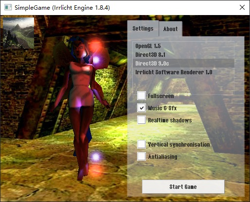
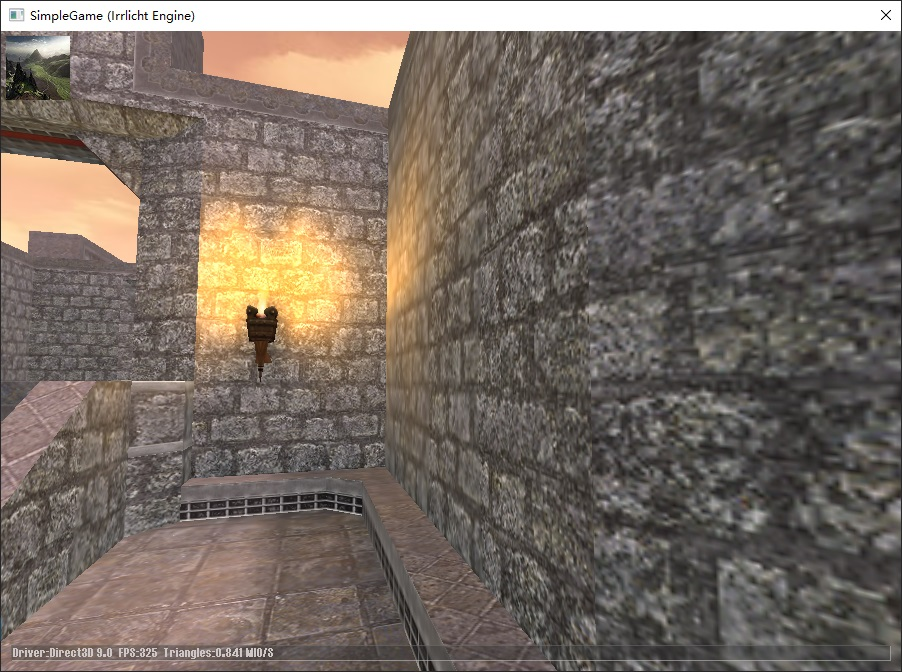

# Learning Irrlicht
A tour of Irrlicht (C++), demos and examples.

**ColorFade**

Color fade in, fade out

**ColorFade.Advanced**

With win32 window

**DrawOverlay**

Draw texture (image)

**DrawOverlay.Advanced**

With win32 window

**Load3DModel**

Load *.3ds model

**MusicReady.Advanced**

See also `LearningIrrKlang/MusicReady`

**SimpleGame**

